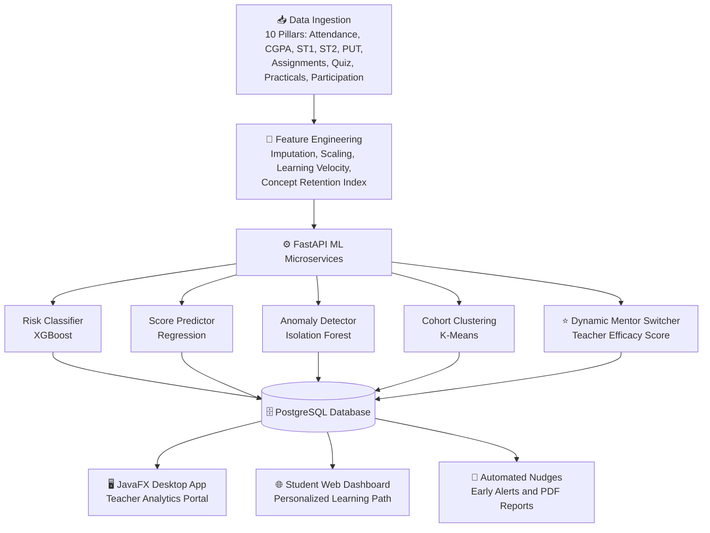
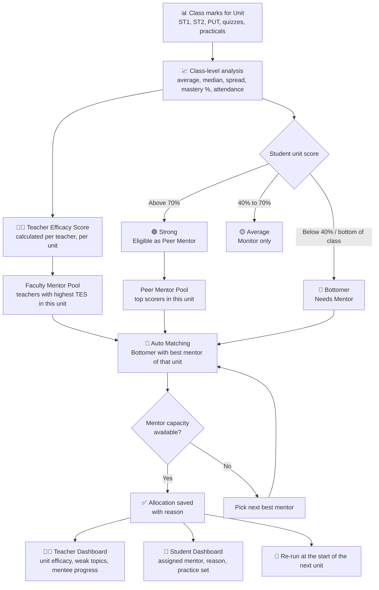
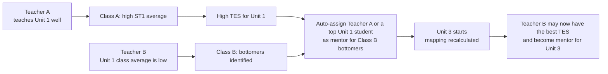
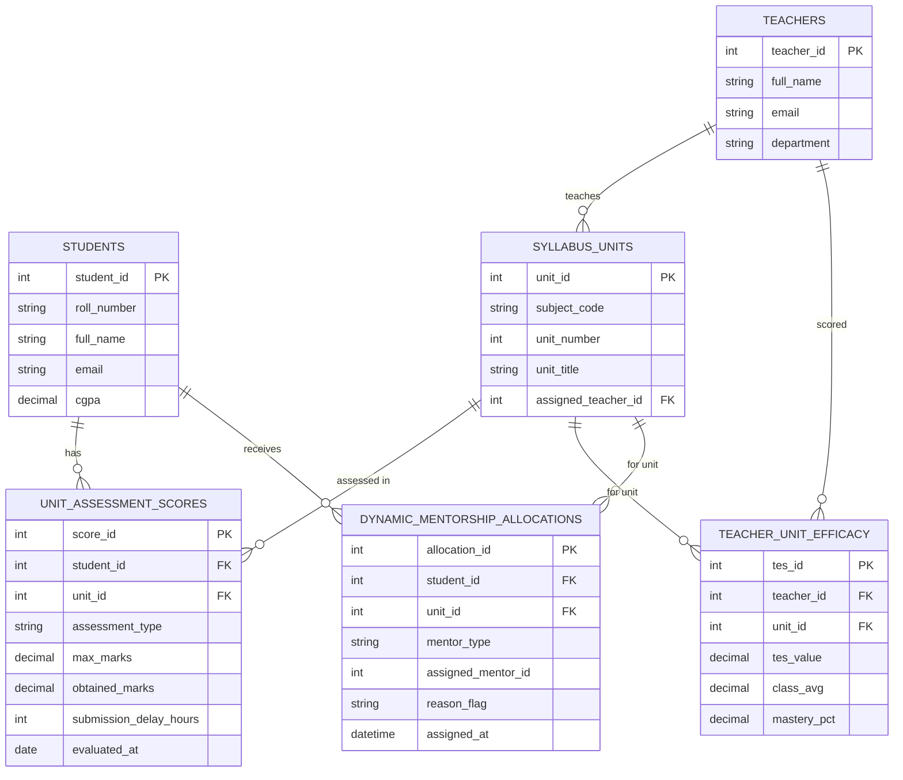

# 🎓 Edu Growth
### AI-Driven Batch Performance & Student Analytics System

> **Team Ctrl Freaks** · Domain: EdTech / Machine Learning · Doc Version 1.0

Edu Growth is a proactive academic analytics platform. Instead of waiting for end-of-semester results, it continuously evaluates **10 data pillars** through **15 analytical engines**, predicts student risk early, finds the exact syllabus units where students struggle, and **automatically assigns a mentor for every unit based on how well each teacher actually performed in that unit**.

---

## 📑 Table of Contents
1. [Problem Statement](#-problem-statement)
2. [Our Solution](#-our-solution)
3. [Overall System Flow](#-overall-system-flow)
4. [⭐ Flagship Feature: Dynamic Unit-Wise Mentorship Engine](#-flagship-feature-dynamic-unit-wise-mentorship-engine)
5. [Additional Features](#-additional-features)
6. [The 10 Data Pillars](#-the-10-core-data-ingestion-pillars)
7. [The 15 Analytical Engines](#-the-15-analytical-engines)
8. [Machine Learning Models](#-machine-learning-models)
9. [Database Design](#-database-design-postgresql)
10. [API Overview](#-api-overview)
11. [Tech Stack](#-tech-stack)
12. [Installation & Setup (No Docker)](#-installation--setup-no-docker)
13. [Project Structure](#-project-structure)
14. [Team](#-team)
15. [Roadmap](#-roadmap)

---

## ⚠️ Problem Statement

| Problem | What happens today |
|---|---|
| **Lagging feedback** | Risk is flagged only after midterms/finals, when it is too late to help. |
| **Coarse evaluation** | A single subject score hides weak units. A student may ace Unit 1 and fail Unit 3. |
| **Static mentorship** | One mentor for the whole semester, even if the mentor is weak in the topic the student needs help with. |
| **Ignored behavioral signals** | Assignment delays, quiz speed, attendance dips and fatigue are never used in evaluation. |

## 💡 Our Solution

- **Granular ingestion** – continuous monitoring of 10 data points (ST1, ST2, PUT, submissions, attendance, etc.).
- **Unit-wise micro-analytics** – weaknesses mapped down to individual syllabus units.
- **Dynamic mentor routing** – faculty and peer mentors reassigned per unit using teacher efficacy.
- **Predictive ML** – XGBoost and regression models forecast scores and fire early warnings.
- **Insights for both sides** – teachers see how their unit performed; students see where they stand and who will help them.

---

## 🗺 Overall System Flow

---

## ⭐ Flagship Feature: Dynamic Unit-Wise Mentorship Engine

Traditional systems give a student one fixed mentor for the entire semester. Edu Growth **re-evaluates mentor mapping for every syllabus unit**, because a teacher who is excellent at Unit 1 may not be the best choice for Unit 3.

### Mentor Assignment Flow

### Example Scenario

### Teacher Efficacy Score (TES)

TES is calculated separately for every teacher and every unit. It combines three things:

| Component | What it measures | Default weight |
|---|---|---|
| **Class improvement** | How much the class average grew from ST1 to ST2 in that unit | 45% |
| **Topic mastery** | Share of students scoring above 70% in that unit | 35% |
| **Attendance retention** | How well the class kept attending during that unit's lectures | 20% |

The weights are configurable and always add up to 100%. A higher TES means the teacher was more effective in that particular unit.

### Mentor Allocation Rules
1. A student qualifies for a mentor in a unit if they fall in the **bottomer bucket** for that unit.
2. **Faculty mentor** is the teacher with the highest TES in that unit.
3. **Peer mentor** is a student with a high score in that unit, good attendance and good consistency.
4. Each mentor has a **capacity limit** (for example, a maximum number of mentees) to avoid overload.
5. Every allocation stores a human-readable **reason**, such as "Scored 32% in Unit 1; mentor has the highest efficacy in Unit 1".
6. Allocation is **re-run at the start of each unit** and can be re-triggered after ST1 or ST2.

### What Each User Sees

**👩‍🏫 Teacher insights**
- Unit-wise efficacy score and rank among all teachers
- Class average, median, spread and mastery % per unit
- Which topics need re-teaching (the *topic* is flagged, not the students)
- List of bottom students and who they have been mapped to
- Mentee progress after mentoring (recovery)

**🎒 Student insights**
- Personal unit-wise score vs. class average and percentile
- Assigned mentor for each weak unit, with the reason
- Personalized practice set and predicted final score
- Recovery progress after mentoring sessions

---

## ➕ Additional Features

| Feature | Description |
|---|---|
| **Teacher Performance Dashboard** | Unit-wise efficacy leaderboard, trend across units, strengths and weaknesses of each teacher. |
| **Mentor Effectiveness Tracking** | Measures score improvement of mentees after mentoring and feeds it back into teacher efficacy. |
| **Peer Mentor Matching** | Top students of a unit become peer mentors for weak students, with workload limits. |
| **Early Warning & Auto-Alerts** | Plain-English alerts to teachers when a student enters High-Risk or triggers an anomaly. |
| **Adaptive Homework Generator** | Practice sets built only from the student's weakest units and micro-topics. |
| **Root Cause Analysis** | Explains *why* a student is failing (for example, mostly missing assignments vs. poor tests). |
| **Learning Velocity & Retention Index** | How quickly a student adapts to a new unit and how much they retain after weeks. |
| **Anomaly / Wellbeing Detector** | Flags sudden drops (for example, 90% to 30% with absenteeism) for pastoral care, not punishment. |
| **Cohort Clustering** | Groups students into High Achievers, Consistent Performers, Slumpers and Critical Need. |
| **Attendance Impact Calculator** | Shows how many marks a student lost by missing specific lectures. |
| **Progress Milestones & Badges** | Milestones for recovery, consistency and on-time submissions. |
| **Parent Sync / PDF Reports** | Auto-generated progress reports and notifications for parents. |
| **Admin / Dean View** | Batch health, top 5% most vulnerable students, batch vs. historical norms. |
| **What-If Simulator** *(planned)* | Shows predicted score if attendance or assignments improve. |
| **Explainable AI (SHAP)** *(planned)* | Per-student explanation for every risk flag. |
| **Role-Based Access** *(planned)* | Separate views for Admin, Teacher, Mentor, Student and Parent. |

---

## 📥 The 10 Core Data Ingestion Pillars

| # | Pillar | What it captures |
|---|---|---|
| 1 | **Unit-Wise Marks (Units 1–5)** | Granular marks per syllabus unit for topic-level understanding. |
| 2 | **Attendance & Regularity Rate** | Rolling 14-day and 30-day attendance metrics. |
| 3 | **Cumulative CGPA Benchmark** | Historical baseline of academic capability. |
| 4 | **Class Aggregates & Percentiles** | Batch mean, spread, median and individual relative rank. |
| 5 | **Practical & Lab Execution** | Hands-on execution, viva ratings, lab report quality. |
| 6 | **Assignment Submission Behavior** | Delay in hours vs. deadline, effort consistency, quality. |
| 7 | **Quiz Performance & Time-on-Task** | Item-level accuracy, speed per question, immediate retention. |
| 8 | **Classroom Activity & Engagement** | Participation, doubt-asking frequency, forum contributions. |
| 9 | **Midterm & Internal Exams (ST1, ST2, PUT)** | Formal assessment milestones mapped to syllabus progress. |
| 10 | **Recent Trend Delta** | Recent momentum: improving or slumping. |

---

## ⚙️ The 15 Analytical Engines

| # | Engine | Purpose |
|---|---|---|
| 01 | **Overall Performance Analysis** | Batch-level health: median, extremes and spread for leadership. |
| 02 | **Student-Wise Deep Dive** | 360° academic profile of one student against their own baseline. |
| 03 | **Subject & Topic-Wise Analysis** | Flags weak *topics* (not students) when most of the class fails a unit. |
| 04 | **Attendance–Performance Correlation** | Marks lost due to specific absences. |
| 05 | **Performance Trend Tracking** | Classifies trajectory: upward, stagnating or downward. |
| 06 | **Risk Classification & Analysis** | Safe / Moderate / High-Risk triage with a daily top 5% list. |
| 07 | **Learning Gap Detection** | Compares quiz (short-term) vs. internals (long-term) retention. |
| 08 | **Consistency & Volatility Analysis** | Steady learner vs. last-minute crammer. |
| 09 | **Improvement Rate (Recovery) Tracking** | Recovery after a failure or mentoring intervention. |
| 10 | **Forward Performance Prediction** | Predicts final marks if current behavior continues. |
| 11 | **Behavioral Outlier Detection** | Detects sudden uncharacteristic drops (possible personal crisis). |
| 12 | **Early Warning & Automated Alerting** | Auto-drafts and routes alerts to teachers. |
| 13 | **Root Cause (Factor Importance) Analysis** | Explains *why* a student is failing. |
| 14 | **Personalized Mentorship Routing** ⭐ | Unit-wise dynamic mentor assignment using teacher efficacy. |
| 15 | **Adaptive Assignment Suggestion Engine** | Personalized remediation practice sets. |

---

## 🤖 Machine Learning Models

| Objective | Algorithm | Input Features | Output & Target Metrics |
|---|---|---|---|
| **At-Risk Student Classifier** | XGBoost + Logistic Regression | Attendance %, ST1/ST2 scores, assignment delays, recent delta, CGPA | Safe vs. At-Risk flag. Target AUC-ROC of 0.89 or more, recall of 0.92 or more |
| **Expected Final Score Predictor** | Ridge Regression / Random Forest | Unit 1–5 marks, learning velocity, quiz speed, post-failure recovery | Predicted final grade %. Target error of 3.8% or less |
| **Anomalous Behavior Detector** | Isolation Forest | Attendance-to-score ratio, sudden score drops above 35%, quiz-assignment gaps | Anomaly or normal flag |
| **Student Cohort Clustering** | K-Means (4 clusters) | Score variance across units, submission delay hours, participation index | High Achievers, Consistent Performers, Slumpers, Critical Need |

### Preprocessing & Feature Engineering
1. **KNN Imputation** – fills missing assignment or quiz entries without distorting class distributions.
2. **Exponential Moving Average** – captures academic momentum over the last 3 assessments.
3. **Standard Scaling & Vectorization** – prepares features for ONNX serialization and FastAPI inference.

---

## 🗄 Database Design (PostgreSQL)

**Table notes**
- `unit_assessment_scores` – assessment type is one of ST1, ST2, PUT, QUIZ, PRACTICAL or ASSIGNMENT.
- `dynamic_mentorship_allocations` – mentor type is FACULTY or PEER, and every row stores a reason.
- `teachers` and `teacher_unit_efficacy` were added on top of the original blueprint so that teacher references are valid and efficacy history can be tracked.

---

## 🔌 API Overview

> Planned REST endpoints (FastAPI). Final routes may change during development.

| Method | Endpoint | Description |
|---|---|---|
| `POST` | `/upload/marks` | Upload CSV of unit-wise marks and assessments |
| `GET`  | `/students/{id}/profile` | Student deep-dive |
| `GET`  | `/students/{id}/risk` | Risk class and root-cause factors |
| `GET`  | `/students/{id}/prediction` | Predicted final score |
| `GET`  | `/units/{unit_id}/analysis` | Topic-wise class analysis |
| `POST` | `/mentorship/run/{unit_id}` | Compute efficacy and run dynamic mentor allocation |
| `GET`  | `/mentorship/student/{id}` | Mentors assigned to a student |
| `GET`  | `/teachers/{id}/efficacy` | Unit-wise efficacy and insights for a teacher |
| `GET`  | `/alerts` | Early-warning alerts list |
| `GET`  | `/reports/{student_id}/pdf` | Auto-generated PDF report |

---

## 🧰 Tech Stack

| Layer | Technology |
|---|---|
| **Desktop Frontend** | Java (JavaFX / Swing) – teacher analytics portal |
| **Student Dashboard** | Web dashboard (personalized learning path) |
| **Backend API** | Python FastAPI (async REST) |
| **Database** | PostgreSQL |
| **ML** | scikit-learn, XGBoost, pandas, NumPy, ONNX Runtime |
| **Deployment** | Runs directly on the machine or server using a Python virtual environment and Uvicorn (**no Docker**) |

---

## 🚀 Installation & Setup (No Docker)

**Prerequisites:** Python 3.10+, PostgreSQL 14+, JDK 17+ with Maven or Gradle, Node.js (for the web dashboard) and Git.

1. **Clone the repository** from GitHub and open the project folder.
2. **Create the database** – create a PostgreSQL database named `edugrowth` and run the schema file from the `database` folder.
3. **Backend** – inside the `backend` folder, create a Python virtual environment, activate it and install the packages listed in `requirements.txt`.
4. **Configure environment** – create a `.env` file in `backend` with your PostgreSQL connection URL and the path of the ML models folder.
5. **Start the API** – run the FastAPI app with Uvicorn on port 8000. Interactive API docs will be available at `http://localhost:8000/docs`.
6. **ML models** – inside the `ml` folder, install its requirements and run the training scripts (risk classifier, score predictor, anomaly detector, clustering). Trained models are exported to `ml/models`.
7. **Desktop app** – inside `frontend-desktop`, build and run the JavaFX app with Maven.
8. **Student web dashboard** – inside `frontend-web`, install dependencies and start the dev server.

---

## 📁 Project Structure

| Folder | Contents |
|---|---|
| `backend/` | FastAPI service: routers (students, units, mentorship, alerts, reports), services (efficacy calculator, mentor allocator), database layer |
| `ml/` | Preprocessing (imputer, moving average, scaler), training scripts, exported models |
| `database/` | PostgreSQL schema file |
| `frontend-desktop/` | JavaFX teacher analytics portal |
| `frontend-web/` | Student dashboard |
| `docs/` | Architecture blueprint and proposal PDFs |
| `README.md` | This file |

---

## 👥 Team

**Team Ctrl Freaks**

| Member | Domain | Mentor(s) |
|---|---|---|
| Suhani Agarwal | Machine Learning | Harsh Raj, Anjali Sirohi |
| Syed Rafiuddin Altamash | Machine Learning | Harsh Raj, Anjali Sirohi |
| Akash Raghuvanshi | Machine Learning | Harsh Raj, Anjali Sirohi |
| Pranav Prajapati | Machine Learning | Harsh Raj, Anjali Sirohi |
| Raunak Agrahari | Frontend | Akshat Sharma |
| Vivek Soni | Backend | Shreya Singh |
| Prashant Singh | Designing | — |

**Module ownership:** Suhani & Pranav – preprocessing and feature engineering; ML team – risk classifier, score predictor, anomaly detection, clustering, mentor switcher; Raunak – JavaFX desktop client; Vivek – FastAPI and PostgreSQL; Prashant – UI/UX design.

---

## 🛣 Roadmap

- [x] System architecture and blueprint
- [x] 10 data pillars and 15 engines defined
- [x] Database design
- [ ] Data ingestion (CSV upload) and preprocessing pipeline
- [ ] Efficacy calculation and dynamic mentor allocation
- [ ] ML model training and export
- [ ] FastAPI endpoints
- [ ] JavaFX teacher portal and student web dashboard
- [ ] Alerts and PDF reports
- [ ] SHAP explainability, What-If simulator, role-based access

---

## 📄 License
Developed by Team Ctrl Freaks for academic purposes. Add a license (for example, MIT) before public release.
