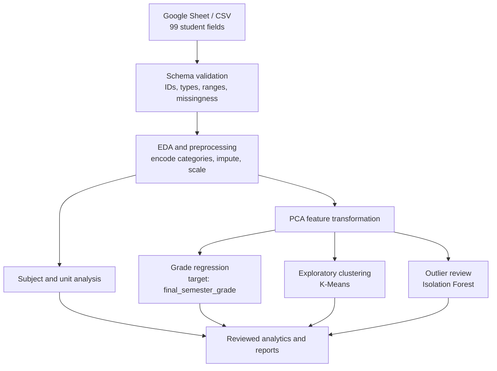
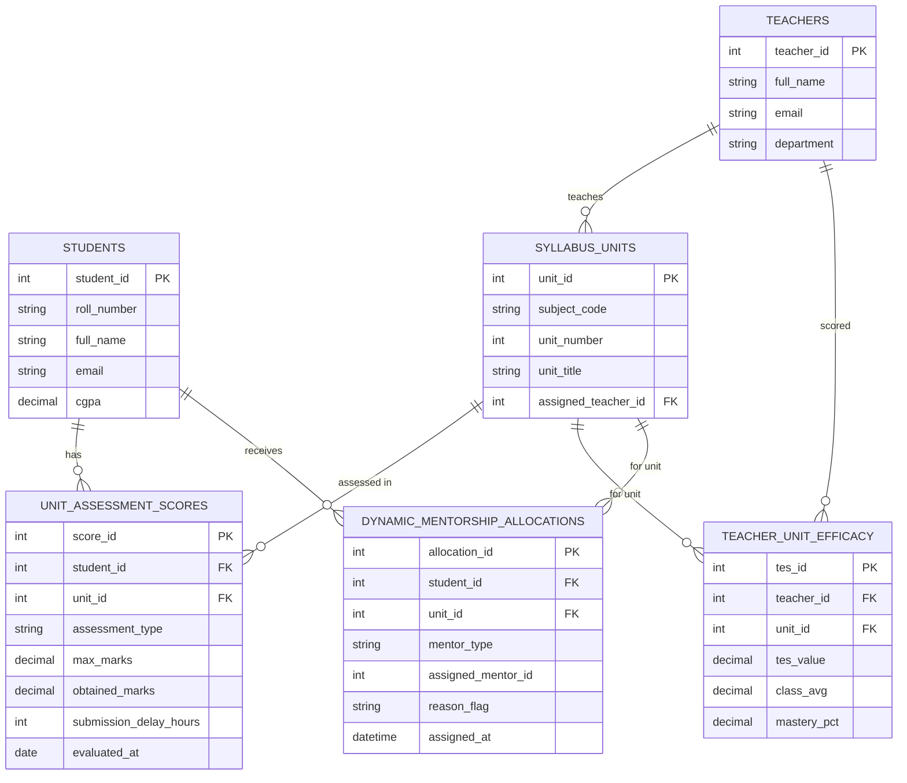

# 🎓 Edu Growth
### AI-Driven Batch Performance & Student Analytics System

> **Team Ctrl Freaks** · Domain: EdTech / Machine Learning · Doc Version 1.0

Edu Growth analyzes a **99-column student performance dataset** covering six subjects, four practical labs, attendance, assignment behavior, extracurricular participation, and prior CGPA. It is designed to surface subject and unit-level patterns, estimate the final semester grade from historical examples, and identify unusual records for review. The current spreadsheet is a student-level snapshot; it does not contain teacher efficacy, risk labels, or assessment dates.

---

## 📑 Table of Contents
1. [Problem Statement](#-problem-statement)
2. [Solution](#-solution)
3. [Dataset: 99 Columns](#-dataset-99-columns)
4. [Analysis Workflow](#-analysis-workflow)
5. [Model Plan](#-model-plan)
6. [Database Design](#-database-design-postgresql)
7. [API Overview](#-api-overview)
8. [Tech Stack](#-tech-stack)
9. [Setup](#-setup)
10. [Project Structure](#-project-structure)
11. [Team](#-team)
12. [Roadmap](#-roadmap)

---

## ⚠️ Problem Statement

| Problem | What happens today |
|---|---|
| **Coarse evaluation** | Overall grades can hide differences between subjects and the five unit scores recorded for each subject. |
| **Disconnected signals** | Attendance, assessment marks, assignment delays, lab performance, and participation are often reviewed separately. |
| **Late intervention** | A final grade alone does not show which currently available signals may warrant an earlier human review. |
| **Unclear patterns** | Staff need a consistent way to compare students and subjects without treating a model score as a diagnosis. |

## 💡 Solution

- **One validated student profile** – ingest the spreadsheet and check required columns, types, duplicates, missing values, and plausible ranges.
- **Subject and unit insights** – compare ST1, ST2, PUT, unit marks, assignments, quizzes, and attendance across the six subjects.
- **Practical performance view** – compare execution and viva scores with submission delays across the four labs.
- **Final-grade estimation** – train a supervised model using `final_semester_grade` as the target and only information available before that outcome.
- **Exploratory student groups and outliers** – use PCA, clustering, and anomaly scores to support review, not to assign definitive risk labels.
- **Human-reviewed support** – show contributing signals and keep medical leave as sensitive context, never as a penalty or an automated decision.

## 🗺 Analysis Workflow



## 📋 Dataset: 99 Columns

**Source:** [Edu Growth student dataset (Google Sheets)](https://docs.google.com/spreadsheets/d/18E6kDb3bGOOatyn9IRaZRoQnjmRVLRNUnkMCi7aCUPo/edit?usp=sharing). Export a CSV copy to `data/raw/` before running analysis. The schema groups below add up to 99 columns.

| Group | Count | Columns |
|---|---:|---|
| Student information and add-ons | 11 | `roll_no`, `full_name`, `class_section`, `overall_attendance_pct`, `theory_attendance_pct`, `practical_attendance_pct`, `previous_cgpa`, `medical_leave_days`, `society_participation_pc`, `sports_activity_level`, `final_semester_grade` |
| Subject attendance | 6 | `coa_attendance_pct`, `maths4_attendance_pct`, `dstl_attendance_pct`, `ds_attendance_pct`, `python_attendance_pct`, `cyber_attendance_pct` |
| Lab attendance | 4 | `lab_ds_attendance_pct`, `lab_python_attendance_pct`, `lab_coa_attendance_pct`, `lab_cyber_attendance_pct` |
| COA assessments | 11 | `coa_st1_marks`, `coa_st2_marks`, `coa_put_marks`, `coa_unit_1_marks`–`coa_unit_5_marks`, `coa_assignment_score`, `coa_assignment_delay_hours`, `coa_quiz_score` |
| Maths4 assessments | 11 | `maths4_st1_marks`, `maths4_st2_marks`, `maths4_put_marks`, `maths4_unit_1_marks`–`maths4_unit_5_marks`, `maths4_assignment_score`, `maths4_assignment_delay_hours`, `maths4_quiz_score` |
| DSTL assessments | 11 | `dstl_st1_marks`, `dstl_st2_marks`, `dstl_put_marks`, `dstl_unit_1_marks`–`dstl_unit_5_marks`, `dstl_assignment_score`, `dstl_assignment_delay_hours`, `dstl_quiz_score` |
| DS assessments | 11 | `ds_st1_marks`, `ds_st2_marks`, `ds_put_marks`, `ds_unit_1_marks`–`ds_unit_5_marks`, `ds_assignment_score`, `ds_assignment_delay_hours`, `ds_quiz_score` |
| Python assessments | 11 | `python_st1_marks`, `python_st2_marks`, `python_put_marks`, `python_unit_1_marks`–`python_unit_5_marks`, `python_assignment_score`, `python_assignment_delay_hours`, `python_quiz_score` |
| Cybersecurity assessments | 11 | `cyber_st1_marks`, `cyber_st2_marks`, `cyber_put_marks`, `cyber_unit_1_marks`–`cyber_unit_5_marks`, `cyber_assignment_score`, `cyber_assignment_delay_hours`, `cyber_quiz_score` |
| Lab performance | 12 | For each of `ds`, `python`, `coa`, and `cyber`: `lab_<subject>_execution_score`, `lab_<subject>_viva_score`, `lab_<subject>_submission_delay_hours` |
| **Total** | **99** | Includes `final_semester_grade`, the supervised-learning target |

The source sheet's actual value formats, score scales, missing-value conventions, and row count must be profiled during EDA. Do not infer scale limits or category encodings from the column names alone.

## 📊 Analysis Capabilities

- **Student and cohort summaries:** compare attendance, prior CGPA, marks, labs, and participation overall and by `class_section`.
- **Subject and unit diagnostics:** compare ST1, ST2, PUT, unit marks, assignment scores/delays, and quiz scores for each subject.
- **Lab diagnostics:** summarize execution, viva, attendance, and submission-delay measures for each lab.
- **Grade prediction:** predict `final_semester_grade` from eligible pre-outcome fields; do not include identifiers or the target among predictors.
- **Exploratory PCA and clustering:** reduce correlated numeric features and examine student groupings; clusters require interpretation and validation.
- **Anomaly review:** use Isolation Forest to flag unusual feature combinations for a person to inspect. An anomaly score is not a validated risk label or diagnosis.

This is a cross-sectional dataset unless additional dated snapshots are supplied. It cannot establish learning velocity, recovery after interventions, or sudden changes over time. It contains no teacher identifiers or teacher outcomes, so teacher-efficacy scoring and automatic faculty assignment are not supported. Peer-mentor suggestions would also need explicit eligibility, capacity, and safeguarding rules before implementation.

---

## 🤖 Machine Learning Models

| Objective | Algorithm | Input Features | Output & Target Metrics |
|---|---|---|---|
| **At-Risk Student Classifier** | XGBoost + Logistic Regression | Attendance %, ST1/ST2 scores, assignment delays, recent delta, CGPA | Safe vs. At-Risk flag. Target AUC-ROC of 0.89 or more, recall of 0.92 or more |
| **Expected Final Score Predictor** | Ridge Regression / Random Forest | Unit 1–5 marks, learning velocity, quiz speed, post-failure recovery | Predicted final grade %. Target error of 3.8% or less |
| **Anomalous Behavior Detector** | Isolation Forest | Attendance-to-score ratio, sudden score drops above 35%, quiz-assignment gaps | Anomaly or normal flag |
| **Student Cohort Clustering** | K-Means (4 clusters) | Score variance across units, submission delay hours, participation index | High Achievers, Consistent Performers, Slumpers, Critical Need |

### Preprocessing & Feature Engineering
1. **KNN Imputation** – fills missing assignment or quiz entries without distorting class distributions.
2. **Exponential Moving Average** – captures academic momentum over the last 3 assessments.
3. **Standard Scaling & Vectorization** – prepares features for ONNX serialization and FastAPI inference.

---

## 🗄 Database Design (PostgreSQL)



**Table notes**
- `unit_assessment_scores` – assessment type is one of ST1, ST2, PUT, QUIZ, PRACTICAL or ASSIGNMENT.
- `dynamic_mentorship_allocations` – mentor type is FACULTY or PEER, and every row stores a reason.
- `teachers` and `teacher_unit_efficacy` were added on top of the original blueprint so that teacher references are valid and efficacy history can be tracked.

---

## 🔌 API Overview

> Planned REST endpoints (FastAPI). Final routes may change during development.

| Method | Endpoint | Description |
|---|---|---|
| `POST` | `/upload/marks` | Upload CSV of unit-wise marks and assessments |
| `GET`  | `/students/{id}/profile` | Student deep-dive |
| `GET`  | `/students/{id}/risk` | Risk class and root-cause factors |
| `GET`  | `/students/{id}/prediction` | Predicted final score |
| `GET`  | `/units/{unit_id}/analysis` | Topic-wise class analysis |
| `POST` | `/mentorship/run/{unit_id}` | Compute efficacy and run dynamic mentor allocation |
| `GET`  | `/mentorship/student/{id}` | Mentors assigned to a student |
| `GET`  | `/teachers/{id}/efficacy` | Unit-wise efficacy and insights for a teacher |
| `GET`  | `/alerts` | Early-warning alerts list |
| `GET`  | `/reports/{student_id}/pdf` | Auto-generated PDF report |

---

## 🧰 Tech Stack

| Layer | Technology |
|---|---|
| **Desktop Frontend** | Java (JavaFX / Swing) – teacher analytics portal |
| **Student Dashboard** | Web dashboard (personalized learning path) |
| **Backend API** | Python FastAPI (async REST) |
| **Database** | PostgreSQL |
| **ML** | scikit-learn, XGBoost, pandas, NumPy, ONNX Runtime |
| **Deployment** | Runs directly on the machine or server using a Python virtual environment and Uvicorn (**no Docker**) |

---

## 🚀 Installation & Setup (No Docker)

**Prerequisites:** Python 3.10+, PostgreSQL 14+, JDK 17+ with Maven or Gradle, Node.js (for the web dashboard) and Git.

1. **Clone the repository** from GitHub and open the project folder.
2. **Create the database** – create a PostgreSQL database named `edugrowth` and run the schema file from the `database` folder.
3. **Backend** – inside the `backend` folder, create a Python virtual environment, activate it and install the packages listed in `requirements.txt`.
4. **Configure environment** – create a `.env` file in `backend` with your PostgreSQL connection URL and the path of the ML models folder.
5. **Start the API** – run the FastAPI app with Uvicorn on port 8000. Interactive API docs will be available at `http://localhost:8000/docs`.
6. **ML models** – inside the `ml` folder, install its requirements and run the training scripts (risk classifier, score predictor, anomaly detector, clustering). Trained models are exported to `ml/models`.
7. **Desktop app** – inside `frontend-desktop`, build and run the JavaFX app with Maven.
8. **Student web dashboard** – inside `frontend-web`, install dependencies and start the dev server.

---

## 📁 Project Structure

```text
data/
├── raw/
├── processed/
└── pca_transformed/
notebooks/
├── 01_eda_data_cleaning.ipynb
├── 02_pca_dimensionality_reduction.ipynb
├── 03_cgpa_prediction_model.ipynb
├── 04_mentor_clustering_model.ipynb
└── 05_risk_isolation_forest.ipynb
ml_pipeline/
├── __init__.py
├── config.py
├── preprocessor.py
├── pca_transformer.py
├── trainer.py
└── utils.py
artifacts/
app/
├── __init__.py
├── main.py
├── api/
│   ├── __init__.py
│   └── v1/
│       ├── __init__.py
│       ├── router.py
│       └── endpoints/
│           ├── __init__.py
│           ├── pca_analytics.py
│           ├── mentor.py
│           ├── cgpa.py
│           ├── risk.py
│           └── velocity.py
├── core/
│   ├── config.py
│   ├── security.py
│   └── database.py
├── services/
│   ├── __init__.py
│   ├── pca_service.py
│   ├── prediction_service.py
│   └── mentor_service.py
└── schemas/
    ├── __init__.py
    ├── student_schema.py
    ├── pca_schema.py
    └── response_schema.py
frontend_javafx/
tests/
├── test_pca_pipeline.py
└── test_endpoints.py
requirements.txt
.env.example
README.md
```

The data and artifact directories start empty. Keep local datasets, trained model files, and `.env` secrets out of version control; `.env.example` is the safe configuration template.

---

## 👥 Team

**Team Ctrl Freaks**

| Member | Domain | Mentor(s) |
|---|---|---|
| Suhani Agarwal | Machine Learning | Harsh Raj, Anjali Sirohi |
| Syed Rafiuddin Altamash | Machine Learning | Harsh Raj, Anjali Sirohi |
| Akash Raghuvanshi | Machine Learning | Harsh Raj, Anjali Sirohi |
| Pranav Prajapati | Machine Learning | Harsh Raj, Anjali Sirohi |
| Raunak Agrahari | Frontend | Akshat Sharma |
| Vivek Soni | Backend | Shreya Singh |
| Prashant Singh | Designing | — |

**Module ownership:** Suhani & Pranav – preprocessing and feature engineering; ML team – risk classifier, score predictor, anomaly detection, clustering, mentor switcher; Raunak – JavaFX desktop client; Vivek – FastAPI and PostgreSQL; Prashant – UI/UX design.

---

## 🛣 Roadmap

- [x] System architecture and blueprint
- [x] 10 data pillars and 15 engines defined
- [x] Database design
- [ ] Data ingestion (CSV upload) and preprocessing pipeline
- [ ] Efficacy calculation and dynamic mentor allocation
- [ ] ML model training and export
- [ ] FastAPI endpoints
- [ ] JavaFX teacher portal and student web dashboard
- [ ] Alerts and PDF reports
- [ ] SHAP explainability, What-If simulator, role-based access

---

## 📄 License
Developed by Team Ctrl Freaks for academic purposes. Add a license (for example, MIT) before public release.
